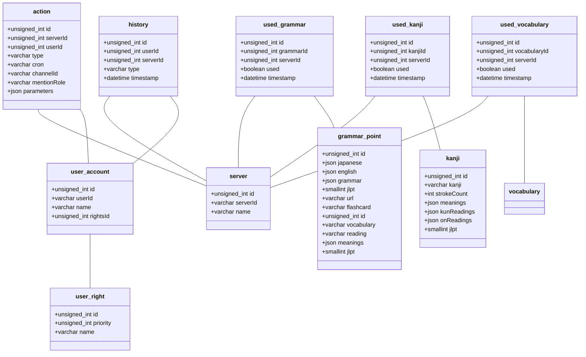

# Release V1.4

## 🆕 What's Changed

- 🗡️ New slash commands
    - 💬 Scheduled messages
    - 📙 Random vocabularies
    - 🤖 Manage used vocabularies
- 🔨 Anti SPAM Bot
- 🐛 Resolve some bugs
    - 📁 JSON error

**Full Changelog**: [v1.2...v1.3](https://github.com/youenPlusquellec/jk_bot/compare/v1.2...v1.3)

<p>&nbsp;</p>

## 🆙 Upgrade v1.3 to v1.4

!!! caution "Pay attention"
    - Execute `database/v1.3_update.sql` to update the database

<p>&nbsp;</p>

## 🗃️ Database scheme



## 🗡️ Slash Commands

-----

<ins>Random kanji :</ins>

This command displays a random kanji from the database and generate an associated image. This task can be scheduled and can ping a specific role.

```
/rkanji [scheduling] [role]
```

- `scheduling` - optional parameter based on [cron task](https://fr.wikipedia.org/wiki/Cron) to program scheduling. If a kanji is generated with this feature, it cannot be recalled by scheduling and consired as already 'used'.

- `role` - optional parameter, If setted, the given role will be ping

-----

<ins>Manage used kanji :</ins>

A kanji can be consired as "used" with rkanji scheduling option, this command manages these used kanjis to list them, clear them, or set them as "used" again

```
/usedkanjis COMMAND
```

- `COMMAND` - mandatory parameter, the action to perform
    - `List` - List 25 last used kanjis by scheduled rkanji task
    - `Clear` - Clear the list of used kanji to allow rkanji task to use them again
    - `Restore all` - Set every cleared kanji of the server to "used" state again

-----

🆕 <ins>Random vocabularies :</ins>

This command displays three random vocabularies from the database. This task can be scheduled and can ping a specific role.

```
/rvocabulary [scheduling] [role]
```

- `scheduling` - optional parameter based on [cron task](https://fr.wikipedia.org/wiki/Cron) to program scheduling. If a kanji is generated with this feature, it cannot be recalled by scheduling and consired as already 'used'.

- `role` - optional parameter, If setted, the given role will be ping

-----

🆕 <ins>Manage used vocabularies :</ins>

A vocabulary can be consired as "used" with rvocabulary scheduling option, this command manages these used vocabularies to list them, clear them, or set them as "used" again

```
/usedvocabularies COMMAND [jlpt]
```

- `COMMAND` - mandatory parameter, the action to perform
    - `List` - List 25 last used kanjis by scheduled rkanji task
    - `Clear` - Clear the list of used kanji to allow rkanji task to use them again
    - `Restore all` - Set every cleared kanji of the server to "used" state again

- `jlpt` - mandatory parameter, the action to perform
    - `N5` - JLPT N3
    - `N4` - JLPT N4
    - `N3` - JLPT N3

-----

<ins>Listing of scheduled tasks :</ins>

This command lists every scheduled tasks on the server or for a specific channel

```
/listscheduledtasks [channel]
```

- `channel` - optional parameter, if setted, the list appears for a specific channel of the server

-----

<ins>Remove a scheduled task :</ins>

This command removes a specific task for a given ID on the server or for a specific channel

```
/removetask ID [channel]
```

- `ID` - mandatory parameter, the id of the task you want to remove

- `channel` - optional parameter, If setted, the suppression for a specific channel of the server

-----

🆕 <ins>Scheduling a message :</ins>

You can schedule a message with this command

```
/scheduledmessage MESSAGE SCHEDULING [role]
```

- `message` - mandatory parameter, the message to send

- `scheduling` - mandatory parameter based on [cron task](https://fr.wikipedia.org/wiki/Cron) to program scheduling. If a kanji is generated with this feature, it cannot be recalled by scheduling and consired as already 'used'.

- `role` - optional parameter, If setted, the given role will be ping

-----

<ins>Ping (pong) :</ins>

Check the connexion between discord and the bot

```
/ping
```

-----

<ins>Prefix :</ins>

Just a test of a modal popup, actually useless

```
/prefix
```

-----

<ins>Help (like everywhere) :</ins>

Get information of a specific command

```
/help COMMAND
```

- `COMMAND` - mandatory parameter, the command you want to have informations

<p>&nbsp;</p>

## 👤 Contextual Commands on User

-----

<ins>Show avatar :</ins>

Display the profile picture of the selected account


-----

<ins>Show info :</ins>

Display informations of the selected account


<p>&nbsp;</p>

## 💬 Contextual Commands on Message

-----

<ins>Hello Worl... You</ins>

Just say hello in response to a message


<p>&nbsp;</p>

!!! note
    For more informations visit [release v1.3](https://github.com/youenPlusquellec/jk_bot/releases/tag/v1.3).
